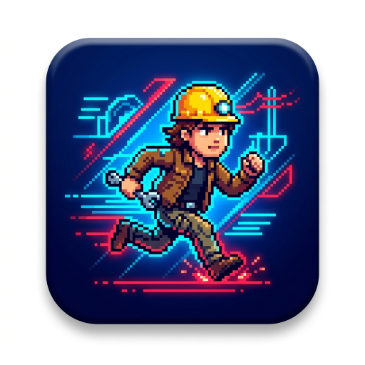

  
  <h1>🔥 Barun's Legacy Run 🔥</h1>
  
<strong>A high-speed, physics-based Endless Runner designed and developed by Barun Kumar Shaw.</strong>

  

 

## 🚀 Play Directly (No Download Required)

The game is completely web-based. You don't need to download any ZIP files or extract code to play. 

👉 **[CLICK HERE TO PLAY LIVE](https://barun-kumar-shaw.github.io/baruns-legacy-run./)**

---

## 📱 How to Install the Game (PC & Mobile)

This game is built as a **Progressive Web App (PWA)**, meaning you can install it directly to your Home Screen or Desktop like a real Native App

### For Mobile Users (Android/iOS) under development there is some issues in phone version soon it will available
1. Open the [Live Link](https://barun-kumar-shaw.github.io/baruns-legacy-run./) in Google Chrome or Safari.
2. **Rotate your phone horizontally (Landscape)** to play.
3. Tap the **3-dots menu** (Chrome) or **Share icon** (Safari).
4. Select **"Add to Home Screen"** or **"Install App"**.
5. The game will now appear as an App on your phone with the premium Barun logo!

### For PC/Laptop Users
1. Open the [Live Link](https://barun-kumar-shaw.github.io/baruns-legacy-run./) in Google Chrome or Edge.
2. Look at the right side of your URL Address Bar (top of the screen).
3. Click the small **Monitor/Download icon** (Install Barun's Legacy Run).
4. The game will now open in its own full-screen window like a real PC game

---

## 🎮 Controls
* **PC:** Press `SPACEBAR` or `Click` anywhere to Jump. Double-tap for Double Jump
* **Mobile:** Tap the `⬆️ JUMP` button or Tap anywhere on the screen.

---

## 👨‍💻 Developer Note
* This game features **Dynamic Responsive Speed** – it will scale perfectly whether you play on a huge PC monitor or a small mobile screen.
* Local Storage keeps track of your personal High Score directly on your device.
* 100% Custom HTML5 Canvas Engine.

<strong>© 2026 Barun Kumar Shaw. All Rights Reserved.</strong>

